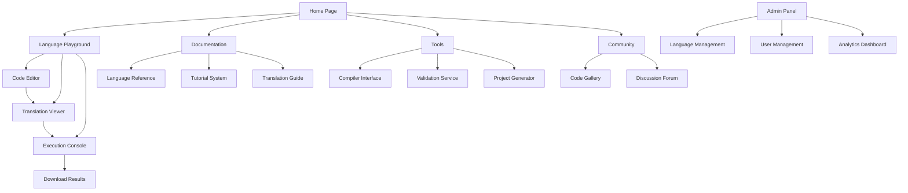

# Y Language Product Requirements Document

## 1. Product Overview

Y language is a revolutionary programming language designed to be as readable as natural English while maintaining the precision and power of traditional programming languages. It serves as an intermediate representation that can be accurately translated to multiple target languages including Rust, TypeScript, Python, Java, and C++.

The language solves the problem of programming language barriers by providing a universal, human-readable syntax that eliminates ambiguity and ensures consistent translation across different LLMs and compilers. This makes programming accessible to non-technical stakeholders while maintaining technical precision for developers.

Target market includes: educational institutions teaching programming, enterprise teams requiring cross-language compatibility, AI-assisted development tools, and developers seeking more maintainable codebases.

## 2. Core Features

### 2.1 User Roles

| Role | Registration Method | Core Permissions |
|------|---------------------|------------------|
| Language Developer | Email registration | Can write Y language code, compile to target languages |
| Language Designer | Admin invitation | Can modify language specification, add new features |
| Tool Developer | GitHub OAuth | Can contribute to parsers, compilers, and tooling |
| Enterprise User | Organization license | Can use Y language in commercial projects |

### 2.2 Feature Module

Our Y language requirements consist of the following main components:

1. **Language Specification**: Grammar rules, syntax patterns, type system, and semantic definitions
2. **Translation Engine**: Y to Rust compiler, Y to TypeScript compiler with 100% feature parity
3. **Parser Framework**: Java-based lexer and parser using ANTLR or similar technology
4. **Compiler Pipeline**: AST generation, semantic analysis, and code generation
5. **Development Tools**: IDE plugins, syntax highlighting, error reporting, and debugging support
6. **Documentation System**: Interactive tutorials, examples, and API references
7. **Testing Framework**: Unit tests, integration tests, and translation verification tools

### 2.3 Page Details

| Page Name | Module Name | Feature description |
|-----------|-------------|---------------------|
| Language Playground | Code Editor | Write Y language code with syntax highlighting, auto-completion, and real-time error detection |
| Language Playground | Translation Viewer | Display generated Rust and TypeScript code side-by-side with Y language source |
| Language Playground | Execution Console | Run compiled code and display output with error handling |
| Documentation | Language Reference | Browse grammar rules, syntax examples, and feature descriptions |
| Documentation | Translation Guide | View mapping between Y language constructs and target language equivalents |
| Documentation | Tutorial System | Interactive step-by-step tutorials with embedded code examples |
| Tools | Compiler Interface | Upload Y language files and download compiled target language code |
| Tools | Validation Service | Verify Y language syntax and semantic correctness |
| Tools | Project Generator | Create starter projects with proper directory structure and configuration |
| Community | Code Gallery | Browse and share Y language examples and projects |
| Community | Discussion Forum | Ask questions, share experiences, and get help from the community |
| Admin | Language Management | Add new language features, modify grammar rules, and manage versions |
| Admin | User Management | Manage user accounts, permissions, and access levels |
| Admin | Analytics Dashboard | View usage statistics, translation success rates, and error patterns |

## 3. Core Process

### User Flow - Language Development
1. User navigates to Language Playground
2. Writes Y language code in the editor with syntax highlighting
3. System validates syntax and semantics in real-time
4. User clicks "Translate" to generate target language code
5. Translation engine processes code and displays Rust/TypeScript output
6. User can execute the compiled code and view results
7. User saves project or downloads generated code

### Developer Flow - Adding New Features
1. Language designer accesses Admin panel
2. Defines new grammar rules using BNF notation
3. Updates parser and compiler specifications
4. Adds translation rules for Rust and TypeScript
5. Tests new features with validation suite
6. Deploys updated language specification

## 4. User Interface Design

### 4.1 Design Style

- **Primary Colors**: Deep blue (#1E3A8A) for headers, light blue (#3B82F6) for accents
- **Secondary Colors**: White (#FFFFFF) for backgrounds, light gray (#F3F4F6) for sections
- **Button Style**: Rounded corners (8px radius), subtle shadows, hover animations
- **Font**: Inter for body text, JetBrains Mono for code blocks
- **Layout**: Card-based design with clear visual hierarchy and responsive grid
- **Icons**: Minimalist line icons from Heroicons or similar library
- **Code Highlighting**: VS Code-inspired dark theme with syntax highlighting

### 4.2 Page Design Overview

| Page Name | Module Name | UI Elements |
|-----------|-------------|-------------|
| Language Playground | Code Editor | Split-pane layout with Y language editor on left, translation output on right. Dark theme with line numbers, syntax highlighting using Prism.js. Auto-completion dropdown with fuzzy search. |
| Language Playground | Translation Viewer | Tabbed interface showing Rust and TypeScript outputs. Syntax-highlighted code with copy buttons. Side-by-side diff view for comparing translations. |
| Language Playground | Execution Console | Terminal-style output area with color-coded messages. Input field for program arguments. Clear and re-run buttons. |
| Documentation | Language Reference | Searchable sidebar navigation with collapsible sections. Main content area with code examples in expandable cards. Breadcrumb navigation. |
| Documentation | Tutorial System | Step-by-step wizard interface with progress indicator. Interactive code exercises with validation. "Try it yourself" embedded editor. |

### 4.3 Responsiveness

The application is designed desktop-first with mobile adaptation. The code editor uses responsive design that adapts to smaller screens by stacking panels vertically. Touch interactions are optimized for tablet use with larger tap targets and gesture support for code navigation.