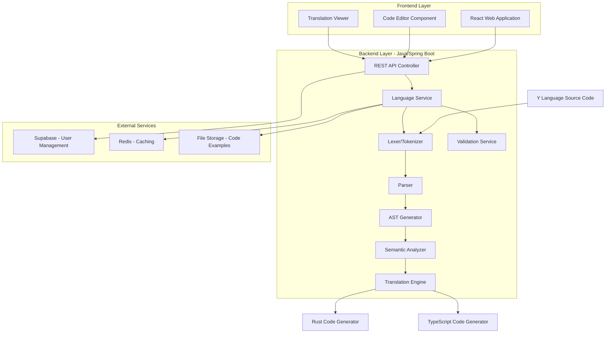
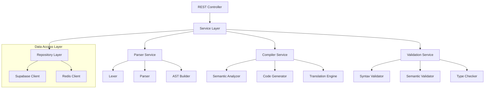
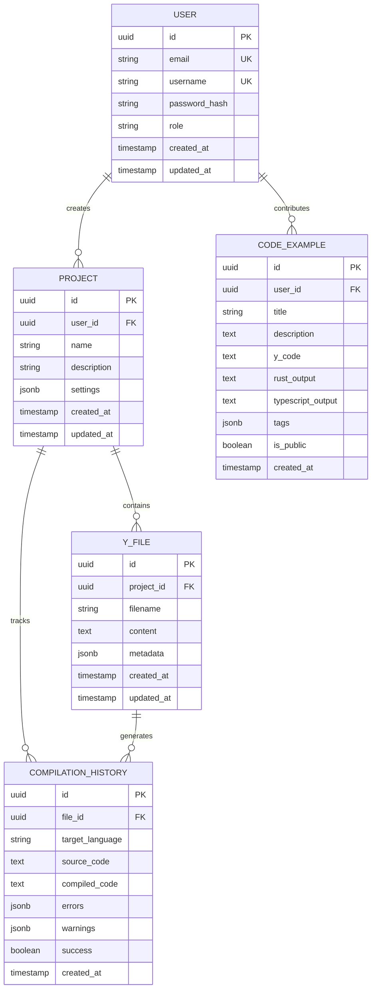

# Y Language Technical Architecture Document

## 1. Architecture Design



## 2. Technology Description

- **Frontend**: React@18 + TypeScript@5 + TailwindCSS@3 + Vite
- **Initialization Tool**: vite-init
- **Backend**: Java 17 + Spring Boot 3.2 + Maven
- **Parser Generator**: ANTLR 4.13.1
- **Database**: Supabase (PostgreSQL)
- **Caching**: Redis
- **Build Tool**: Maven
- **Testing**: JUnit 5 + Mockito + Spring Boot Test

## 3. Route Definitions

| Route | Purpose |
|-------|---------|
| /api/v1/compile | Compile Y language code to target languages |
| /api/v1/validate | Validate Y language syntax and semantics |
| /api/v1/translate | Translate Y language to specific target language |
| /api/v1/execute | Execute compiled code in sandboxed environment |
| /api/v1/projects | Manage Y language projects |
| /api/v1/examples | Browse and retrieve code examples |
| /api/v1/documentation | Retrieve language specification and documentation |
| /api/v1/tutorials | Get interactive tutorial content |
| /api/auth/* | User authentication and authorization |
| /api/admin/* | Admin panel for language management |

## 4. API Definitions

### 4.1 Compilation API

```
POST /api/v1/compile
```

Request:
| Param Name | Param Type | isRequired | Description |
|------------|------------|------------|-------------|
| code | string | true | Y language source code |
| targetLanguage | string | true | Target language (rust/typescript) |
| projectId | string | false | Associated project ID |

Response:
| Param Name | Param Type | Description |
|------------|------------|-------------|
| success | boolean | Compilation status |
| compiledCode | string | Generated target language code |
| errors | array | List of compilation errors |
| warnings | array | List of compilation warnings |
| ast | object | Abstract syntax tree representation |

Example:
```json
{
  "code": "create function addNumbers with parameters a as number and b as number that returns number begin return a plus b end",
  "targetLanguage": "rust"
}
```

### 4.2 Validation API

```
POST /api/v1/validate
```

Request:
| Param Name | Param Type | isRequired | Description |
|------------|------------|------------|-------------|
| code | string | true | Y language source code |

Response:
| Param Name | Param Type | Description |
|------------|------------|-------------|
| valid | boolean | Validation result |
| errors | array | Syntax and semantic errors |
| suggestions | array | Code improvement suggestions |

## 5. Server Architecture Diagram



## 6. Data Model

### 6.1 Data Model Definition



### 6.2 Data Definition Language

User Table (users)
```sql
-- create table
CREATE TABLE users (
    id UUID PRIMARY KEY DEFAULT gen_random_uuid(),
    email VARCHAR(255) UNIQUE NOT NULL,
    username VARCHAR(100) UNIQUE NOT NULL,
    password_hash VARCHAR(255) NOT NULL,
    role VARCHAR(50) DEFAULT 'user' CHECK (role IN ('user', 'admin', 'language_designer')),
    created_at TIMESTAMP WITH TIME ZONE DEFAULT NOW(),
    updated_at TIMESTAMP WITH TIME ZONE DEFAULT NOW()
);

-- create index
CREATE INDEX idx_users_email ON users(email);
CREATE INDEX idx_users_username ON users(username);
```

Project Table (projects)
```sql
-- create table
CREATE TABLE projects (
    id UUID PRIMARY KEY DEFAULT gen_random_uuid(),
    user_id UUID NOT NULL REFERENCES users(id) ON DELETE CASCADE,
    name VARCHAR(255) NOT NULL,
    description TEXT,
    settings JSONB DEFAULT '{}',
    created_at TIMESTAMP WITH TIME ZONE DEFAULT NOW(),
    updated_at TIMESTAMP WITH TIME ZONE DEFAULT NOW()
);

-- create index
CREATE INDEX idx_projects_user_id ON projects(user_id);
CREATE INDEX idx_projects_created_at ON projects(created_at DESC);
```

Y File Table (y_files)
```sql
-- create table
CREATE TABLE y_files (
    id UUID PRIMARY KEY DEFAULT gen_random_uuid(),
    project_id UUID NOT NULL REFERENCES projects(id) ON DELETE CASCADE,
    filename VARCHAR(255) NOT NULL,
    content TEXT NOT NULL,
    metadata JSONB DEFAULT '{}',
    created_at TIMESTAMP WITH TIME ZONE DEFAULT NOW(),
    updated_at TIMESTAMP WITH TIME ZONE DEFAULT NOW()
);

-- create index
CREATE INDEX idx_y_files_project_id ON y_files(project_id);
```

Compilation History Table (compilation_history)
```sql
-- create table
CREATE TABLE compilation_history (
    id UUID PRIMARY KEY DEFAULT gen_random_uuid(),
    file_id UUID NOT NULL REFERENCES y_files(id) ON DELETE CASCADE,
    target_language VARCHAR(50) NOT NULL CHECK (target_language IN ('rust', 'typescript')),
    source_code TEXT NOT NULL,
    compiled_code TEXT NOT NULL,
    errors JSONB DEFAULT '[]',
    warnings JSONB DEFAULT '[]',
    success BOOLEAN NOT NULL DEFAULT false,
    created_at TIMESTAMP WITH TIME ZONE DEFAULT NOW()
);

-- create index
CREATE INDEX idx_compilation_history_file_id ON compilation_history(file_id);
CREATE INDEX idx_compilation_history_created_at ON compilation_history(created_at DESC);
```

## 7. Parser and Compiler Architecture

### 7.1 Lexical Analysis
The lexer tokenizes Y language source code into meaningful tokens using ANTLR lexer rules. Key token categories:
- Keywords: `create`, `function`, `variable`, `if`, `else`, `loop`, etc.
- Identifiers: Variable and function names
- Operators: `plus`, `minus`, `times`, `divided by`, `equals`, etc.
- Literals: Numbers, strings, booleans
- Delimiters: `begin`, `end`, `with`, `that`, etc.

### 7.2 Syntax Analysis
The parser builds an Abstract Syntax Tree (AST) using ANTLR parser rules. Grammar structure:
```antlr
program : statement+ ;
statement : functionDeclaration | variableDeclaration | assignment | controlFlow ;
functionDeclaration : 'create' 'function' identifier 'with' 'parameters' parameterList 'that' 'returns' type 'begin' statement+ 'end' ;
```

### 7.3 Semantic Analysis
Validates semantic correctness:
- Type checking and inference
- Variable scope analysis
- Function signature validation
- Import/export resolution

### 7.4 Code Generation
Translates AST to target languages:
- **Rust Generator**: Emphasizes memory safety, ownership, and lifetimes
- **TypeScript Generator**: Focuses on type definitions and modern JavaScript features

## 8. Translation Examples

### Y Language Example
```y
create function calculateArea with parameters radius as number that returns number
begin
    create variable pi as number equals 3.14159
    return pi times radius times radius
end
```

### Rust Translation
```rust
pub fn calculate_area(radius: f64) -> f64 {
    let pi: f64 = 3.14159;
    return pi * radius * radius;
}
```

### TypeScript Translation
```typescript
function calculateArea(radius: number): number {
    const pi: number = 3.14159;
    return pi * radius * radius;
}
```

## 9. Testing Strategy

### 9.1 Unit Testing
- Parser tests for each grammar rule
- AST validation tests
- Translation accuracy tests
- Edge case handling

### 9.2 Integration Testing
- End-to-end compilation pipeline
- Multi-file project compilation
- Error handling and reporting
- Performance benchmarking

### 9.3 Translation Verification
- Round-trip translation testing
- Feature parity validation
- Target language compilation verification
- Runtime behavior comparison